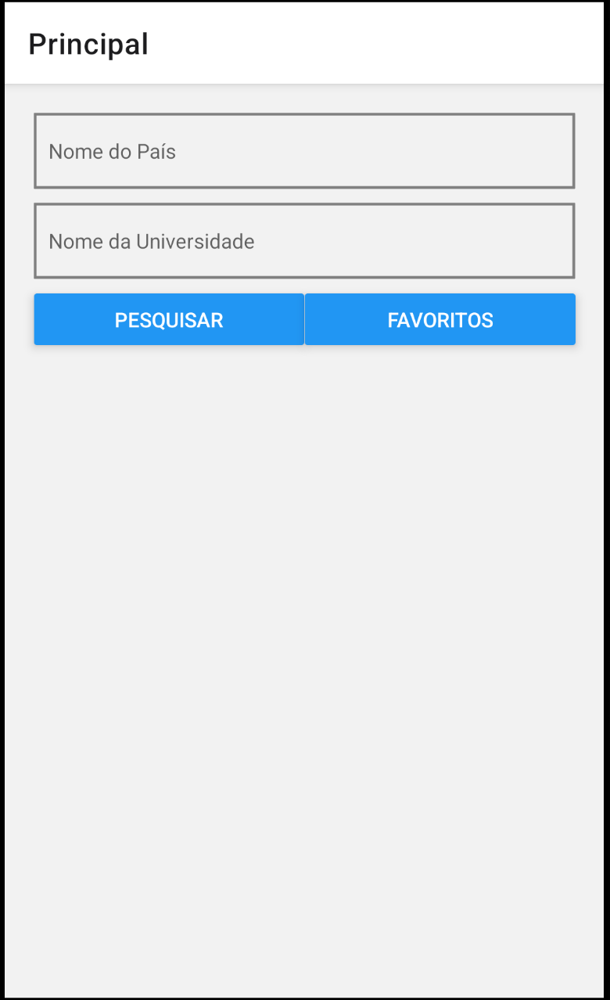
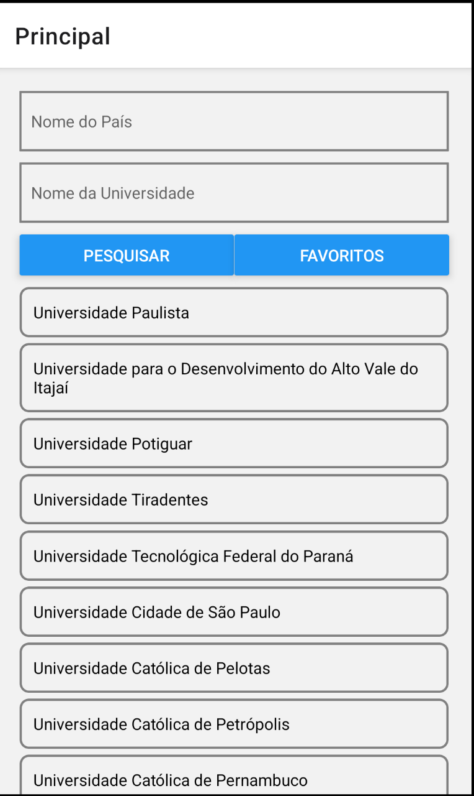
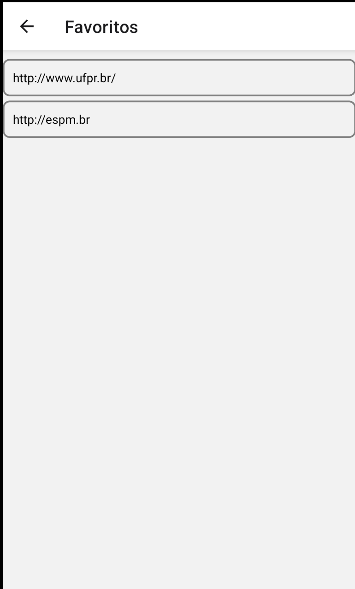

## Trabalho 02 - React Native - Pesquisa de Universidades

- Seguir o roteiro abaixo para criar um app de pesquisa de universidades

- O trabalho deve ser individual

- Efetuar a entrega por meio do canvas enviando **APENAS** os arquivos **.js** (não precisa enviar o projeto inteiro!)

- Utilizar o **endpoint** abaixo para obter uma lista de universidades pelo nome e país:

`http://universities.hipolabs.com/search?name=Univ&country=brazil`

- Pode-se enviar somente o nome do país, por exemplo

`http://universities.hipolabs.com/search?country=brazil`

- Ou da universidade

`http://universities.hipolabs.com/search?name=Univ`

- Ou ambos

`http://universities.hipolabs.com/search?country=brazi&name=Univ`

- Criar um app utilizando React Native onde existam dois campos (país e universidade) em que o usuário possa informar os dados da pesquisa (deve informar ao menos um deles)

- Efetuar a requisição **GET** conforme a **URL** acima e exibir o resultado em uma lista

<table>
<tr>
<td width="20%">

</td>
<td valign="top"  width="80%>

Apresentar a tela de pesquisa onde o usuário pode informar o nome do país e a univeridade para pesquisar

Ao clicar em Pesquisar enviar a requisição GET no endpoint acima

Exibir o resultado em uma lista

O retorno será um array contendo objetos JSON no seguinte formato:

<code>
{"web_pages": ["http://www.unip-objetivo.br/"], "domains": ["unip-objetivo.br"], "country": "Brazil", "alpha_two_code": "BR", "name": "Universidade Paulista", "state-province": null}

</code>
 
Exibir o <b>name</b> na lista
</td>
</tr>
<tr>
<td>

</td>
<td valign="top">
Ao clicar sobre o nome de uma universidade na lista persistir no banco de dados o nome da universidade e a <b>web_pages</b> (obter o primeiro da lista do array)  

Direcionar para a página de Favoritos

</td>
</tr>
<tr>
<td>

</td>
<td valign="top" >
Efetuar uma pesquisa no banco de dados e listar os sites das universidades favoritas
  
Ao clicar sobre uma linha da lista remover o item do banco de dados
</td>
</tr>
</table>